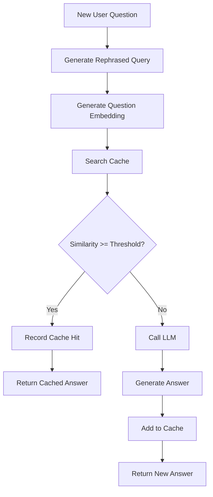

# AskWealth Caching Module Documentation

## Overview

The AskWealth Caching Module is a sophisticated question-answer caching system designed to reduce redundant LLM calls by storing and reusing answers to previously asked questions. The module uses semantic similarity matching with pgvector to identify similar questions and return cached answers when appropriate.

## Architecture

### Core Components

1. **Cache Configuration (`askwealth.cache_config`)** - Stores configurable parameters
2. **Q&A Cache Table (`askwealth.qa_cache`)** - Main storage for cached question-answer pairs with embeddings
3. **Q&A Extraction View (`askwealth.v_qa_pairs`)** - Extracts Q&A pairs from existing message data
4. **Cache Functions** - Lookup, population, and maintenance operations
5. **Monitoring Views** - Statistics and performance tracking

## Database Schema

### Cache Configuration Table

```sql
askwealth.cache_config
├── config_key (varchar) - Configuration parameter name
├── config_value (jsonb) - Parameter value
├── description (text) - Human-readable description
├── created_at (timestamp)
└── updated_at (timestamp)
```

**Default Configuration Values:**

- `similarity_threshold`: 0.85 (minimum cosine similarity for cache hits)
- `cache_ttl_days`: 30 (cache entry expiration time)
- `max_cache_size`: 10000 (maximum cache entries)
- `enable_cache`: true (global cache enable/disable)
- `rephrasing_enabled`: true (use rephrased queries for matching)

### Q&A Cache Table

```sql
askwealth.qa_cache
├── cache_id (uuid) - Unique cache entry identifier
├── thread_id (uuid) - Reference to conversation thread
├── user_message_id (uuid) - Reference to user's question message
├── assistant_message_id (uuid) - Reference to assistant's answer message
├── original_question (text) - User's original question
├── rephrased_question (text) - LLM-generated rephrased query
├── question_embedding (vector) - Vector embedding for similarity search
├── answer_text (text) - Assistant's answer
├── answer_metadata (jsonb) - Additional answer context/metadata
├── cache_hits (integer) - Number of times this cache entry was used
├── last_hit_at (timestamp) - Last time this entry was accessed
├── quality_score (decimal) - Optional quality rating
├── created_at (timestamp)
├── updated_at (timestamp)
└── created_by (varchar)
```

### Q&A Extraction View

The `askwealth.v_qa_pairs` view extracts question-answer pairs from the existing message table:

```sql
askwealth.v_qa_pairs
├── thread_id (uuid)
├── thread_title (varchar)
├── thread_creator (varchar)
├── user_message_id (uuid)
├── assistant_message_id (uuid)
├── original_question (text) - Extracted from user message parts
├── rephrased_question (text) - Extracted from message annotations
├── answer_text (text) - Extracted from assistant message parts
├── user_annotations (jsonb)
├── assistant_annotations (jsonb)
├── question_time (timestamp)
└── answer_time (timestamp)
```

## Core Functions

### Cache Lookup

#### `askwealth.find_cached_answer(question_embedding, similarity_threshold)`

Finds the most similar cached question above the similarity threshold.

**Parameters:**

- `question_embedding` (vector): Embedding of the query to match
- `similarity_threshold` (decimal, optional): Override default threshold

**Returns:**

- `cache_id`: Unique identifier of the matching cache entry
- `original_question`: Original user question
- `rephrased_question`: Rephrased version used for matching
- `answer_text`: Cached answer
- `answer_metadata`: Additional answer context
- `similarity_score`: Cosine similarity score (0.0 to 1.0)
- `cache_hits`: Number of times this entry has been used
- `created_at`: When the cache entry was created

**Usage Example:**

```sql
-- Find cached answer for a new question
SELECT * FROM askwealth.find_cached_answer('[0.1, 0.2, 0.3, ...]'::vector, 0.87);
```

#### `askwealth.record_cache_hit(cache_id)`

Updates cache hit statistics when a cached answer is used.

**Parameters:**

- `cache_id` (uuid): ID of the cache entry that was accessed

**Returns:** Boolean indicating success

### Cache Population

#### `askwealth.add_to_cache(...)`

Adds a new question-answer pair to the cache.

**Parameters:**

- `thread_id` (uuid): Conversation thread
- `user_message_id` (uuid): User's question message
- `assistant_message_id` (uuid): Assistant's answer message
- `original_question` (text): User's original question
- `rephrased_question` (text, optional): Rephrased version
- `question_embedding` (vector, optional): Pre-computed embedding
- `answer_text` (text): Assistant's answer
- `answer_metadata` (jsonb, optional): Additional context
- `created_by` (varchar, optional): Creator identifier

**Returns:** UUID of the new cache entry

#### `askwealth.populate_cache_from_history()`

Populates the cache with Q&A pairs from existing message history.

**Returns:** Integer count of newly cached entries

### Cache Maintenance

#### `askwealth.cleanup_expired_cache()`

Removes cache entries older than the configured TTL.

**Returns:** Integer count of deleted entries

#### `askwealth.enforce_cache_size_limit()`

Removes oldest/least-used entries when cache exceeds size limit.

**Returns:** Integer count of deleted entries

## Integration Workflow

### 1. Initial Setup

```sql
-- Run the caching module SQL to create all components
\i caching-module.sql

-- Populate cache from existing message history
SELECT askwealth.populate_cache_from_history();
```

### 2. Query Processing Flow



### 3. Application Integration Points

#### Before LLM Call

```python
# Pseudo-code for application integration
def get_answer(user_question):
    # 1. Generate rephrased query
    rephrased_query = rephrase_question(user_question)

    # 2. Generate embedding
    embedding = generate_embedding(rephrased_query)

    # 3. Check cache
    cached_result = db.execute("""
        SELECT * FROM askwealth.find_cached_answer(%s::vector)
    """, [embedding])

    if cached_result:
        # 4. Record cache hit
        db.execute("""
            SELECT askwealth.record_cache_hit(%s::uuid)
        """, [cached_result['cache_id']])

        return cached_result['answer_text']

    # 5. Proceed with LLM call
    answer = call_llm(user_question, rephrased_query)

    # 6. Cache the result
    db.execute("""
        SELECT askwealth.add_to_cache(%s, %s, %s, %s, %s, %s::vector, %s)
    """, [thread_id, user_msg_id, assistant_msg_id,
          user_question, rephrased_query, embedding, answer])

    return answer
```

## Monitoring and Analytics

### Cache Statistics View

```sql
-- Get overall cache statistics
SELECT * FROM askwealth.v_cache_stats;
```

**Provides:**

- Total cache entries
- Entries with embeddings
- Entries that have been hit
- Total and average cache hits
- Age distribution of entries

### Performance Metrics

```sql
-- Get detailed cache metrics
SELECT * FROM askwealth.get_cache_metrics(30);  -- Last 30 days
```

**Provides:**

- Cache size and storage usage
- Current configuration values
- Performance indicators

### Cache Hit Rate Analysis

```sql
-- Analyze cache effectiveness
SELECT
    COUNT(*) as total_cached_questions,
    COUNT(CASE WHEN cache_hits > 0 THEN 1 END) as questions_with_hits,
    ROUND(
        COUNT(CASE WHEN cache_hits > 0 THEN 1 END)::decimal / COUNT(*) * 100,
        2
    ) as cache_utilization_percent,
    SUM(cache_hits) as total_hits_served,
    AVG(cache_hits) as avg_hits_per_question
FROM askwealth.qa_cache
WHERE created_at >= CURRENT_DATE - INTERVAL '30 days';
```

## Configuration Management

### Adjusting Similarity Threshold

```sql
-- Increase threshold for more strict matching
UPDATE askwealth.cache_config
SET config_value = '0.90'
WHERE config_key = 'similarity_threshold';

-- Decrease threshold for more lenient matching
UPDATE askwealth.cache_config
SET config_value = '0.80'
WHERE config_key = 'similarity_threshold';
```

### Cache Size Management

```sql
-- Increase cache size limit
UPDATE askwealth.cache_config
SET config_value = '20000'
WHERE config_key = 'max_cache_size';

-- Set shorter TTL for faster turnover
UPDATE askwealth.cache_config
SET config_value = '14'
WHERE config_key = 'cache_ttl_days';
```

### Enable/Disable Caching

```sql
-- Disable caching globally
UPDATE askwealth.cache_config
SET config_value = 'false'
WHERE config_key = 'enable_cache';

-- Re-enable caching
UPDATE askwealth.cache_config
SET config_value = 'true'
WHERE config_key = 'enable_cache';
```

## Maintenance Tasks

### Daily Maintenance

```sql
-- Clean up expired entries and enforce size limits
SELECT askwealth.cleanup_expired_cache();
SELECT askwealth.enforce_cache_size_limit();
```

### Weekly Analysis

```sql
-- Review cache performance
SELECT * FROM askwealth.v_cache_stats;
SELECT * FROM askwealth.get_cache_metrics(7);

-- Identify popular questions
SELECT
    original_question,
    rephrased_question,
    cache_hits,
    created_at
FROM askwealth.qa_cache
WHERE cache_hits > 5
ORDER BY cache_hits DESC
LIMIT 20;
```

### Monthly Optimization

```sql
-- Analyze similarity threshold effectiveness
SELECT
    'Above 0.95' as similarity_range,
    COUNT(*) as cache_entries
FROM askwealth.qa_cache qc1
WHERE EXISTS (
    SELECT 1 FROM askwealth.qa_cache qc2
    WHERE qc2.cache_id != qc1.cache_id
    AND (1 - (qc1.question_embedding <=> qc2.question_embedding)) > 0.95
)
UNION ALL
SELECT
    'Above 0.90' as similarity_range,
    COUNT(*) as cache_entries
FROM askwealth.qa_cache qc1
WHERE EXISTS (
    SELECT 1 FROM askwealth.qa_cache qc2
    WHERE qc2.cache_id != qc1.cache_id
    AND (1 - (qc1.question_embedding <=> qc2.question_embedding)) > 0.90
);
```

## Performance Considerations

### Indexing

The module creates the following indexes for optimal performance:

1. **Vector Similarity Index**: IVFFlat index on `question_embedding` for fast similarity search
2. **Thread Index**: B-tree index on `thread_id` for filtering by conversation
3. **Temporal Index**: B-tree index on `created_at` for time-based queries
4. **Usage Index**: B-tree index on `cache_hits` for popularity analysis

### Embedding Dimensions

The default implementation assumes 1536-dimensional embeddings (OpenAI Ada-002). Adjust the vector size in the table definition if using different embedding models:

```sql
-- For different embedding dimensions
ALTER TABLE askwealth.qa_cache
ALTER COLUMN question_embedding TYPE extensions.vector(768);  -- Example for other models
```

### Vector Index Tuning

For better performance with large datasets, tune the IVFFlat index:

```sql
-- Recreate index with more lists for larger datasets
DROP INDEX idx_qa_cache_embedding;
CREATE INDEX idx_qa_cache_embedding
ON askwealth.qa_cache USING ivfflat (question_embedding vector_cosine_ops)
WITH (lists = 200);  -- Increase for larger datasets
```

## Security Considerations

1. **Data Privacy**: The cache stores user questions and system answers. Ensure compliance with data retention policies.

2. **Access Control**: Restrict access to cache management functions to authorized users only.

3. **Data Sanitization**: The view extraction logic should handle potentially malicious content in JSONB fields.

4. **Audit Trail**: All cache operations are logged with timestamps and user identifiers.

## Troubleshooting

### Common Issues

1. **No Cache Hits**: Check if embeddings are being generated and stored correctly
2. **Poor Cache Performance**: Analyze similarity threshold and embedding quality
3. **Memory Usage**: Monitor vector index size and consider archiving old entries
4. **Slow Queries**: Ensure indexes are created and statistics are up to date

### Diagnostic Queries

```sql
-- Check for entries without embeddings
SELECT COUNT(*) FROM askwealth.qa_cache WHERE question_embedding IS NULL;

-- Verify extraction view is working
SELECT COUNT(*) FROM askwealth.v_qa_pairs;

-- Check configuration
SELECT * FROM askwealth.cache_config;

-- Monitor recent cache activity
SELECT * FROM askwealth.qa_cache
WHERE last_hit_at >= CURRENT_DATE - INTERVAL '1 day'
ORDER BY last_hit_at DESC;
```

This caching module provides a robust foundation for reducing LLM costs while maintaining high-quality responses through intelligent similarity matching and comprehensive monitoring capabilities.
